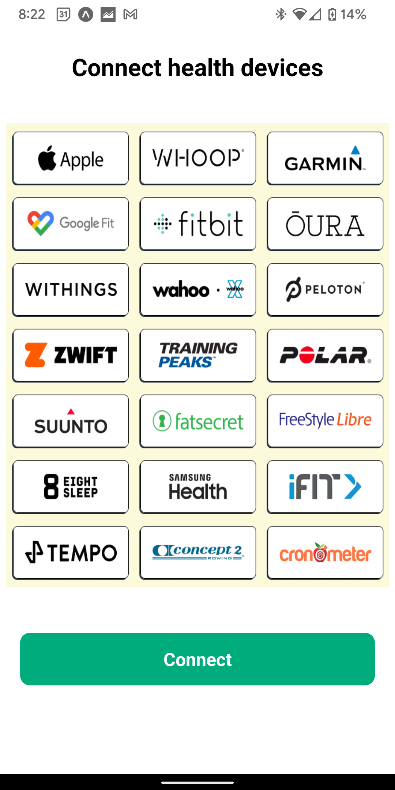
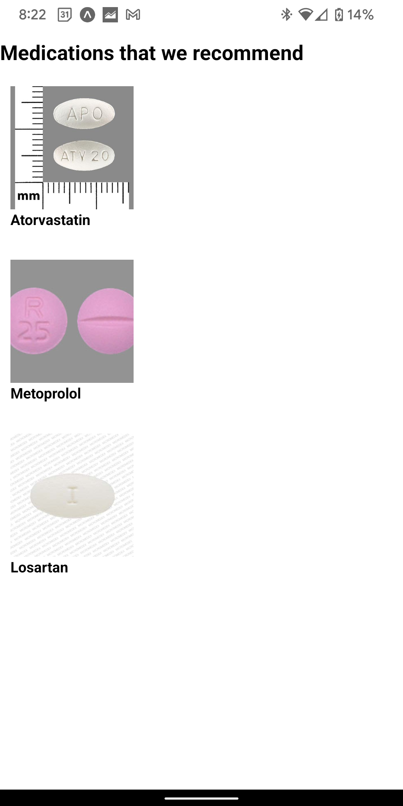
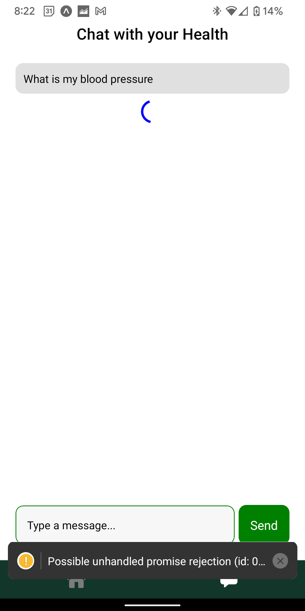

# PrescribeRx

PrescribeRx is a cross-platform mobile application that predicts what medications patients should take based on various health indicators that could be found on wearable devices, such as an apple watch.

For technical detail, check out [the devpost](https://devpost.com/software/prescriberx)

## Screenshots

    
    
    
    

